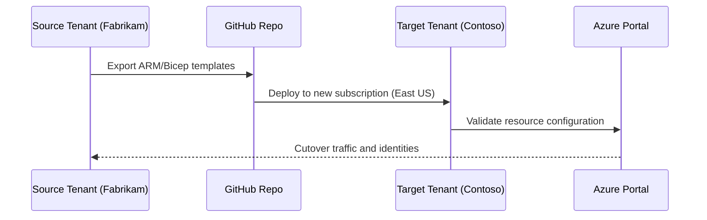

# 🧭 Azure Tenant Workload Migration Mini-Camp  
*By [Olumide Towoju](https://github.com/olumidetowoju)*

> Learn how to **define and implement a cross-tenant workload migration strategy** in Azure to support business transformations such as acquisitions or divestitures — all from your **Azure Free Tier** environment.

---

## 🌍 Course Overview

This blockbuster 10-day mini-camp will guide you step-by-step through migrating workloads securely across **Azure security tenants**.  
You’ll play the role of a **Cloud Architect** executing an **acquisition scenario** — moving workloads from a *Source Tenant* to a *Target Tenant* while maintaining governance, identity, and security.

Each day builds on the last, and includes:
- Hands-on Azure Portal + CLI/Bicep/PowerShell labs  
- Concept explanations with **analogies and diagrams**  
- Quizzes and checkpoints  
- Cost-saving and cleanup tasks  
- Nano-style file creation instructions (for example: `nano day01-strategy/README.md`)

---

## 📘 Directory

| Day | Topic | Description |
|-----|--------|-------------|
| [Day 1 – Strategy & Planning](day01-strategy/README.md) | Define migration goals, architecture, and business drivers |
| [Day 2 – Environment Prep](day02-environment-prep/README.md) | Build Source and Target tenants, set up subscriptions, configure roles |
| [Day 3 – Identity & Networking](day03-identity-networking/README.md) | Connect identity models and establish cross-tenant trust and networks |
| [Day 4 – Workload Inventory](day04-workload-inventory/README.md) | Discover and map workloads for migration |
| [Day 5 – Migration Automation](day05-migration-automation/README.md) | Use Bicep, ARM, and CLI automation for deployment |
| [Day 6 – Data & Apps Migration](day06-data-apps-migration/README.md) | Migrate storage, databases, and app workloads |
| [Day 7 – Validate & Secure](day07-validate-secure/README.md) | Validate performance, apply policies, ensure zero data loss |
| [Day 8 – Go-Live & Cutover](day08-go-live-cutover/README.md) | Switch production workloads to the target tenant |
| [Day 9 – Cleanup & Governance](day09-cleanup-governance/README.md) | Remove legacy assets, apply governance, and cost control |
| [Day 10 – Review & Next Steps](day10-review-next-steps/README.md) | Summarize lessons, discuss next projects, and final quiz |

---

## 🧩 Course Scenario

You are a **Cloud Solutions Architect** supporting **Contoso** (the acquiring company) that is acquiring **Fabrikam** (the source).  
You will:
1. Prepare two Azure tenants (Source = Fabrikam, Target = Contoso).  
2. Plan and execute cross-tenant resource migration.  
3. Automate, test, and validate the new tenant environment.

**Analogy:**  
> Migrating a cloud workload across tenants is like moving a fully-operational city to another country —  
> you must rebuild its roads (networks), issue new passports (identities), and re-establish utilities (resources).

---

## 🔁 Workflow Overview

---

## 🧠 Prerequisites

Azure Free Tier Subscription

Region: East US

Install the following tools:

az version
az login
git --version
code --version  # (or use nano)
Global Admin or Owner permissions in both tenants

Basic knowledge of networking, identity, and resource groups

🛠 Tech Stack
Area	Tools/Service
Infrastructure as Code	ARM, Bicep
Automation	Azure CLI, PowerShell
CI/CD	GitHub Actions
Governance	Azure Policy, RBAC, Tags
Networking	VNet Peering, VPN, DNS
Identity	Microsoft Entra ID (Azure AD)
Data	Azure SQL, Blob Storage
Security	Azure Key Vault, Managed Identities

💡 How to Use

# Clone repo
git clone https://github.com/olumidetowoju/azure-tenant-workload-migration.git
cd azure-tenant-workload-migration

# Open first lesson
nano day01-strategy/README.md
Each daily module includes step-by-step tasks, code, diagrams, and checkpoints.
You can also export all markdowns to PDF at the end using:

pandoc -s -o azure-tenant-workload-migration.pdf README.md

## 📚 References

Microsoft Learn: Migrate cloud workloads across security tenants

Azure Resource Move limitations

Azure Subscription and Tenant Overview

## 🗂 Folder Structure

Each dayXX folder contains:

README.md: The textbook-style, step-by-step tutorial with diagrams, commands, checkpoints, and quiz questions.

Optional scripts: Each day may include scripts (CLI, PowerShell, or Bicep templates) tied to its lab.

## 📅 Next Step

➡ Proceed to Day 1 – Strategy & Planning
Begin your journey toward mastering cross-tenant workload migration in Azure.

Authored by: Olumide Towoju
Course version: 1.0 | Region: East US | License: Free Tier Learning Use
