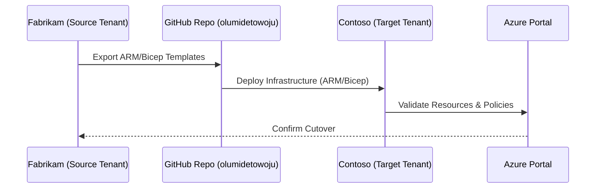

# 🧭 Day 1 – Strategy & Planning

Azure Tenant Workload Migration Mini-Camp

“Before we move the cloud workloads, we move the vision.”
This first day lays the blueprint — why, what, and how to migrate workloads across security tenants.

# 🎯 Objectives

By the end of Day 1 you will:

Understand what cross-tenant workload migration is and why it’s needed.

Define your source and target tenants (Fabrikam → Contoso).

Identify migration drivers (acquisition, divestiture, modernization).

Plan a high-level migration strategy and architecture.

Prepare for environment setup (Day 2).

# 🧩 Concept Overview

🌐 What Is a Tenant Migration?

An Azure tenant represents a dedicated, secure boundary under Microsoft Entra ID.
Migrating workloads across tenants is often required when:

A business acquires another organization.

A division is spun off into a new company.

A company restructures its governance model.

Analogy:

Imagine two office buildings owned by different companies.
Each has its own security, badges, and networks.
Migrating workloads is like moving an entire department from one building to another —
you must re-issue access badges (identities), move the servers (resources), and re-connect the power (network).

# 🧱 Lab Architecture Diagram

---

# ⚙️ Identity Model & Scenario

We’ll simulate an acquisition scenario:

Role	Tenant	Description
Source Tenant	Fabrikam (onmicrosoft.com)	Company being acquired; existing workloads
Target Tenant	Contoso (onmicrosoft.com)	Acquiring company; future host of workloads

Identity Model: Target-centric

Users and groups are re-created or synchronized into the target tenant.

Workloads are deployed anew in the target environment.

Source tenant remains read-only during cut-over validation.

# 🧠 Strategy Planning Steps

## Step 1 – Define Business Objectives

Clarify why the migration is happening:

Acquisition: merge and centralize workloads.

Divestiture: split and re-host.

Compliance: meet data-sovereignty or security requirements.

## Step 2 – Assess Current State (Source Tenant)

Document the current resources:

Resource Groups, VNets, VMs, Storage, Key Vaults, SQL, App Services.

Network dependencies (VPN Gateways, DNS, Firewalls).

Identity dependencies (Managed Identities, Service Principals, RBAC assignments).

Run the following in Azure CLI:

az login
az account show
az resource list --output table

## Step 3 – Design Target State (Target Tenant)

Decide how resources will map to the target:

Keep naming conventions consistent.

Use resource tags like Owner=olumidetowoju, Lab=Day01, Scenario=Acquisition.

Use East US region for cost control.

## Step 4 – Choose Migration Approach
Approach	Description	Toolset
Re-Deploy (Recommended)	Export templates from source and deploy to target	ARM/Bicep, CLI, PowerShell
Move (Resource Move)	Use Azure Resource Move feature (but limited cross-tenant)	Portal, CLI
Hybrid Approach	Re-deploy core services, re-connect data	Mixed methods

# 🧰 Hands-On Lab Tasks

## Task 1 – Create Initial Directories
mkdir -p day01-strategy
nano day01-strategy/README.md

## Task 2 – Login to Azure
az login
az account list -o table
az account set --subscription

## Task 3 – Prepare Variable Files

Create a Bash variables file for future days:

nano scripts/cli/vars.sh

export LOCATION="eastus"
export SOURCE_TENANT="fabrikam.onmicrosoft.com"
export TARGET_TENANT="contoso.onmicrosoft.com"
export RG_SOURCE="rg-01-eus-src"
export RG_TARGET="rg-01-eus-tgt"

Save and load:

source scripts/cli/vars.sh

# 🧭 Deliverables

Defined migration strategy document (in docs/).

Populated variables file (scripts/cli/vars.sh).

Confirmed subscription and region.

Drafted architecture diagram.

# 🧩 Quiz – Checkpoint

What is the difference between “tenant” and “subscription”?

Why is the “re-deploy” approach safer for cross-tenant migrations?

In our scenario, which tenant acts as the acquiring organization?

What are two benefits of tagging resources with metadata?

What Azure region are we using and why?

# 🧼 Cleanup Tasks
az logout

(We don’t create resources yet on Day 1, so no teardown needed.)

# 📅 Next Step

➡ Proceed to Day 2 – Environment Prep

where you’ll create the source and target tenants and prepare subscriptions for migration.

Authored by Olumide Towoju

Course Version 1.0 | Region: East US | License: Free Tier Learning Use
