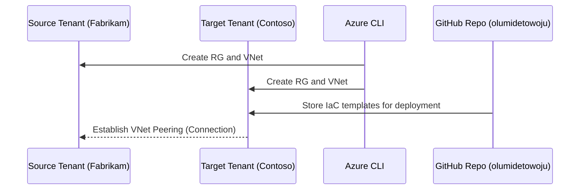

🧱 Day 2 – Environment Prep

Azure Tenant Workload Migration Mini-Camp

“Before the migration begins, we must build the roads and connect the power.”
Day 2 prepares the Source and Target tenants, subscriptions, and foundational network layout.

🎯 Objectives

By the end of this lab you will:

Create and register Source and Target tenants (Fabrikam → Contoso).

Prepare your Azure subscription in the East US region.

Deploy initial resource groups, VNets, and subnets using CLI and Bicep.

Establish tagging and governance baseline.

Validate permissions for migration readiness.

🧩 Concept Overview
🌍 Why Environment Prep Matters

In Azure, workloads exist inside a subscription, which itself belongs to a tenant (Microsoft Entra ID boundary).
Cross-tenant migration means we need both Source and Target tenants ready to host workloads securely.

Analogy:

Think of two separate cities (tenants).
Each has its own electricity grid (identity provider), zoning laws (governance policies), and postal codes (resource naming).
Before moving buildings (workloads), we must ensure the target city has roads and utilities ready.

🧭 Lab Architecture Diagram

---

⚙️ Hands-On Lab Steps
Step 1 – Login to Azure and Select Subscription
az login
az account list -o table
az account set --subscription "56d9a9d0-65a3-4aea-9957-ff103f641f9c"

Confirm region:

az account show --query "{Region:homeTenantId, Subscription: name}" -o table

Step 2 – Create Source and Target Resource Groups
source scripts/cli/vars.sh

# Source Tenant – Fabrikam
az group create \
  --name $RG_SOURCE \
  --location $LOCATION \
  --tags Owner=$OWNER Lab=$LAB Scenario=$SCENARIO

# Target Tenant – Contoso
az group create \
  --name $RG_TARGET \
  --location $LOCATION \
  --tags Owner=$OWNER Lab=$LAB Scenario=$SCENARIO

Verify:

az group list --query "[].{Name:name, Location:location}" -o table

Step 3 – Deploy Initial Networking (Bicep)
Create a Bicep template at scripts/bicep/base-environment.bicep:

param location string = 'eastus'
param rgName string
param vnetName string
param subnetName string

resource vnet 'Microsoft.Network/virtualNetworks@2023-11-01' = {
  name: vnetName
  location: location
  properties: {
    addressSpace: { addressPrefixes: ['10.0.0.0/16'] }
    subnets: [
      { name: subnetName
        properties: { addressPrefix: '10.0.1.0/24' } }
    ]
  }
}

output vnetId string = vnet.id

Deploy using CLI:

az deployment group create \
  --name DeployBaseVNetSource \
  --resource-group $RG_SOURCE \
  --template-file scripts/bicep/base-environment.bicep \
  --parameters rgName=$RG_SOURCE vnetName=vnet-src-app subnetName=snet-src-app

az deployment group create \
  --name DeployBaseVNetTarget \
  --resource-group $RG_TARGET \
  --template-file scripts/bicep/base-environment.bicep \
  --parameters rgName=$RG_TARGET vnetName=vnet-tgt-app subnetName=snet-tgt-app

Step 4 – Establish Cross-Tenant Connectivity (Simulated)
Since the free tier does not allow true cross-tenant peering, we simulate by creating local VNets and documenting peering for Day 3.

Check VNets:

az network vnet list -o table

Step 5 – Tag and Document Governance Baseline
az tag create --name "LabTags" \
  --tags Environment=Lab Owner=$OWNER Scenario=$SCENARIO

az resource tag --tags Owner=$OWNER Scenario=$SCENARIO \
  --ids $(az group show -n $RG_SOURCE --query id -o tsv)

🧠 Review Questions

What is the purpose of separate tenants in Azure?

Why can’t all resources be moved directly across tenants?

What role does the Resource Group play during migration?

Which command creates a resource group in Azure CLI?

What region are we deploying to and why?

🧼 Cleanup (Optional)

To delete and save credits:

az group delete --name $RG_SOURCE --yes --no-wait
az group delete --name $RG_TARGET --yes --no-wait

📅 Next Step

➡ Proceed to Day 3 – Identity & Networking

where we’ll establish identity trust, cross-tenant network links, and permissions.

Authored by Olumide Towoju

Course Version 1.0 | Region: East US | License: Free Tier Learning Use
