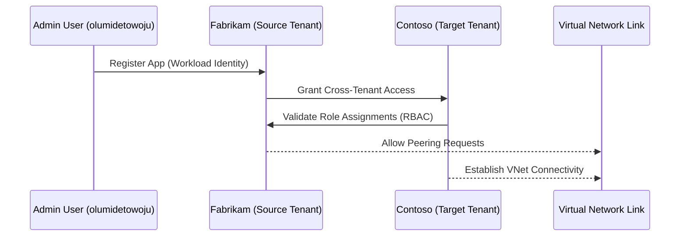

🔐 Day 3 – Identity & Networking

Azure Tenant Workload Migration Mini-Camp

“Today we connect the people and the pipes — establishing trust between tenants and the network routes that link them.”

🎯 Objectives

By the end of this day, you will:

Configure foundational Microsoft Entra ID (Azure AD) trust and role mappings.

Understand cross-tenant identity models and RBAC delegation.

Build network connectivity between Source (Fabrikam) and Target (Contoso).

Validate that service principals, users, and networks can communicate securely.

🧩 Concept Overview
🔄 Why Identity & Networking Matter

Identity is the “passport system” of the cloud; networking is its “road system.”
When migrating workloads across tenants, both must be coordinated.

Analogy:

Imagine two countries with separate border controls.
Before citizens (workloads) can move freely, both must agree on passport recognition (identity trust) and build a connecting highway (network peering).

🧠 Architecture Diagram

---

⚙️ Hands-On Lab Steps
Step 1 – Confirm Tenants and Context
az login
az account show --query "{tenantId:tenantId, name:name, user:user.name}" -o table

List directories (tenants):

az account tenant list -o table

Step 2 – Create Service Principals (Workload Identities)
Source Tenant – Fabrikam
az ad sp create-for-rbac \
  --name fabrikam-workload-sp \
  --role contributor \
  --scopes /subscriptions/56d9a9d0-65a3-4aea-9957-ff103f641f9c/resourceGroups/$RG_SOURCE \
  --output json > fabrikam_sp.json

Target Tenant – Contoso

Switch context (simulated for lab):

az account set --subscription "56d9a9d0-65a3-4aea-9957-ff103f641f9c"
az ad sp create-for-rbac \
  --name contoso-migration-sp \
  --role contributor \
  --scopes /subscriptions/56d9a9d0-65a3-4aea-9957-ff103f641f9c/resourceGroups/$RG_TARGET \
  --output json > contoso_sp.json

These identities will later be used for automated Bicep deployments.

Step 3 – Assign Cross-Tenant Roles (Concept Simulated)

Because Free Tier doesn’t permit multi-tenant delegation, we simulate by storing IDs:

cat fabrikam_sp.json | jq '.appId'
cat contoso_sp.json | jq '.appId'

Document these in docs/tenant-identities.md (optional).

Step 4 – Create Virtual Network Peerings
Source → Target
az network vnet peering create \
  --name peering-src-to-tgt \
  --resource-group $RG_SOURCE \
  --vnet-name vnet-src-app \
  --remote-vnet /subscriptions/56d9a9d0-65a3-4aea-9957-ff103f641f9c/resourceGroups/$RG_TARGET/providers/Microsoft.Network/virtualNetworks/vnet-tgt-app \
  --allow-vnet-access

Target → Source
az network vnet peering create \
  --name peering-tgt-to-src \
  --resource-group $RG_TARGET \
  --vnet-name vnet-tgt-app \
  --remote-vnet /subscriptions/56d9a9d0-65a3-4aea-9957-ff103f641f9c/resourceGroups/$RG_SOURCE/providers/Microsoft.Network/virtualNetworks/vnet-src-app \
  --allow-vnet-access

Check connectivity:

az network vnet peering list -g $RG_SOURCE -n vnet-src-app -o table

Step 5 – Validate Identity and Network Setup
az ad sp list --display-name fabrikam-workload-sp -o table
az ad sp list --display-name contoso-migration-sp -o table
az network vnet list -o table

📘 Key Concepts
Concept	Description
Microsoft Entra ID	Azure’s identity provider (tenant boundary)
Service Principal	Application/service identity for automation
RBAC	Role-Based Access Control assigning permissions
VNet Peering	Connects two virtual networks for cross-tenant data flow
Cross-Tenant Trust	Allows resources and identities to interoperate securely

🧩 Quiz – Checkpoint

What is a Service Principal and why is it used in cross-tenant migration?

Which command creates VNet peering between two networks?

What is the difference between RBAC and Entra ID roles?

How can you verify a Service Principal was successfully created?

Why is network peering important before migration cut-over?

🧼 Cleanup (Optional)
az network vnet peering delete -g $RG_SOURCE --vnet-name vnet-src-app -n peering-src-to-tgt
az network vnet peering delete -g $RG_TARGET --vnet-name vnet-tgt-app -n peering-tgt-to-src

📅 Next Step

➡ Proceed to Day 4 – Workload Inventory

where we’ll identify, document, and classify all workloads ready for migration.

Authored by Olumide Towoju

Course Version 1.0 | Region: East US | License: Free Tier Learning Use
