# 📦 Day 4 – Workload Inventory

Azure Tenant Workload Migration Mini-Camp

“You can’t move what you haven’t counted.”
Today you’ll discover, classify, and export definitions of your source workloads so we can redeploy them in the target tenant.

# 🎯 Objectives

By the end of this lab you will:

Enumerate all resources in the Source RG and related dependencies.

Build a Migration Manifest (CSV/YAML) mapping source → target.

Export an ARM template for the RG and optionally decompile to Bicep.

Identify can-move vs re-deploy items for cross-tenant migration.

# 🧩 Concept Overview

Analogy:

Think of the source workload like a factory floor. Day 4 is the audit:
you walk the aisles and tag each machine (VMs, Storage, SQL), trace the power lines (VNets),
and note any special certifications (managed identity, Key Vault).
The manifest is your master checklist for moving day.

Some resource types can’t be directly moved across tenants (identity-bound services, certain managed resources). We’ll bias for re-deploy using exported templates + parameters.

# 🧠 Architecture Sequence

```mermaid
sequenceDiagram
    participant SourceRG as Source RG (Fabrikam)
    participant CLI as Azure CLI / PowerShell
    participant Manifest as Migration Manifest (docs/)
    participant Repo as GitHub Repo

    CLI->>SourceRG: List resources + dependencies
    CLI->>Manifest: Generate CSV/YAML mapping (source→target)
    CLI->>Repo: Export ARM template (optional: decompile → Bicep)
    Repo-->>Manifest: Commit manifest & templates
```

---

# ⚙️ Hands-On Lab Steps

Pre-req: You completed Day 2 and Day 3; you have scripts/cli/vars.sh loaded.

1) Load variables and confirm scope
source scripts/cli/vars.sh

echo "RG_SOURCE=$RG_SOURCE"
echo "RG_TARGET=$RG_TARGET"
echo "LOCATION=$LOCATION"

2) Quick inventory (tables)
# All resources in the source RG
az resource list -g "$RG_SOURCE" -o table

# Common workloads (run any/all that apply)
az vm list -g "$RG_SOURCE" -d -o table
az network vnet list -g "$RG_SOURCE" -o table
az storage account list -g "$RG_SOURCE" -o table
az sql server list -g "$RG_SOURCE" -o table
az keyvault list -g "$RG_SOURCE" -o table

3) Save machine-readable inventory (JSON)
az resource list -g "$RG_SOURCE" -o json > docs/source-inventory.json

4) Create a Migration Manifest (CSV)

Create the CSV:

nano docs/migration-manifest.csv

Paste this starter (edit rows as you discover items):

sourceResourceId,resourceType,sourceName,targetName,notes,migrationStrategy,tags
/subscriptions/""/resourceGroups/rg-01-eus-src/providers/Microsoft.Network/virtualNetworks/vnet-src-app,Microsoft.Network/virtualNetworks,vnet-src-app,vnet-tgt-app,"10.0.0.0/16 -> 10.1.0.0/16",Re-deploy,"Owner=olumidetowoju;Scenario=acquisition"
/subscriptions/""/resourceGroups/rg-01-eus-src/providers/Microsoft.Network/virtualNetworks/vnet-src-app/subnets/snet-src-app,Microsoft.Network/virtualNetworks/subnets,snet-src-app,snet-tgt-app,"10.0.1.0/24 -> 10.1.1.0/24",Re-deploy,"Lab=day04"
/subscriptions/""/resourceGroups/rg-01-eus-src/providers/Microsoft.Compute/virtualMachines/vm-app-01,Microsoft.Compute/virtualMachines,vm-app-01,vm-app-01,"B1s, Gen2",Re-deploy,"CostTier=free"
/subscriptions/""/resourceGroups/rg-01-eus-src/providers/Microsoft.Storage/storageAccounts/st01app,Microsoft.Storage/storageAccounts,st01app,st01apptgt,"name must be globally unique",Re-deploy,"DataClass=app"
/subscriptions/""/resourceGroups/rg-01-eus-src/providers/Microsoft.Sql/servers/sqlsrc01,Microsoft.Sql/servers,sqlsrc01,sqltgt01,"Basic tier if free/low cost",Re-deploy,"Backup=on"

You’ll update this file as your discovery grows. It becomes the source of truth for Day 5–8.

5) Optional: Export ARM template of the RG

Azure’s export is convenient but not guaranteed to cover everything; treat it as a scaffold.

# Export a template of the entire RG
az group export --name "$RG_SOURCE" --resource-ids $(az resource list -g "$RG_SOURCE" --query "[].id" -o tsv) > docs/source-rg-template.json

If az group export is not available in your CLI version, fall back to exporting per resource and then merge:

for id in $(az resource list -g "$RG_SOURCE" --query "[].id" -o tsv); do
  rid=$(echo "$id" | sed 's#[/ ]#_#g')
  az resource show --ids "$id" -o json > "docs/exported/${rid}.json"
done

Create the folder beforehand if using per-resource export:

mkdir -p docs/exported

6) Optional: Decompile ARM → Bicep

If you exported docs/source-rg-template.json, you can attempt a decompile:

# Requires Bicep CLI installed (az bicep version)
az bicep version

# Decompile
az bicep decompile --file docs/source-rg-template.json
# This produces docs/source-rg-template.bicep (you can refactor into clean modules for Day 5)

Decompilation isn’t perfect; we’ll refactor into neat modules in Day 5 – Migration Automation.

7) Generate a human-friendly Inventory Report

Create a simple CLI script (bash) to dump a CSV view from your RG:

nano scripts/cli/inventory.sh

Paste:

#!/usr/bin/env bash
set -euo pipefail

RG="${1:-$RG_SOURCE}"

echo "resourceId,resourceType,location,tag_Owner,tag_Lab,tag_Scenario"
az resource list -g "$RG" --query '[].{id:id, type:type, location:location, tags:tags}' -o json |
  jq -r '.[] | "\(.id),\(.type),\(.location),\(.tags.Owner // ""),\(.tags.Lab // ""),\(.tags.Scenario // "")"'

Make it executable and run it:

chmod +x scripts/cli/inventory.sh
scripts/cli/inventory.sh > docs/source-inventory.csv

(If you don’t have jq, install it, or change the script to -o tsv and massage with awk.)

8) (Optional) PowerShell inventory
nano scripts/powershell/inventory.ps1

Paste:

param(
  [string]$ResourceGroup = $env:RG_SOURCE
)

$resources = az resource list -g $ResourceGroup -o json | ConvertFrom-Json
$rows = @()

foreach ($r in $resources) {
  $row = [pscustomobject]@{
    resourceId   = $r.id
    resourceType = $r.type
    location     = $r.location
    tag_Owner    = if ($r.tags) { $r.tags.Owner } else { "" }
    tag_Lab      = if ($r.tags) { $r.tags.Lab } else { "" }
    tag_Scenario = if ($r.tags) { $r.tags.Scenario } else { "" }
  }
  $rows += $row
}

$rows | Export-Csv -NoTypeInformation -Path "docs/source-inventory-ps.csv"
Write-Host "Inventory written to docs/source-inventory-ps.csv"

Run:

pwsh -f scripts/powershell/inventory.ps1

# 🧠 Classify: Re-deploy vs Special Handling

Create a helper note (optional):

nano docs/move-vs-redeploy.md

Guidance to jot down:

Re-deploy: VNets, Subnets, NSGs, VMs, Storage, App Service, SQL (export data separately), Key Vault (recreate, re-import secrets).

Special: Managed identities, some PaaS with tenant-locked identities, role assignments (recreate in target), Private Endpoints (recreate), DNS zones (re-point), Public IPs (can’t keep same IP).

You’ll use this classification to fill the migration-manifest.csv.

# ✅ Deliverables

docs/source-inventory.json + docs/source-inventory.csv (or -ps.csv).

docs/migration-manifest.csv with at least your core items filled.

Optional: docs/source-rg-template.json and docs/source-rg-template.bicep.

Optional: docs/move-vs-redeploy.md notes.

# 🧩 Quiz – Checkpoint

Why is a migration manifest essential in cross-tenant moves?

What’s a key limitation of az group export you should keep in mind?

Name two resource types that typically require re-deploy across tenants.

Where do you record the new names of resources that must be globally unique (e.g., Storage accounts)?

Which command produced the machine-readable list of all resources in the RG?

# 🧼 Cleanup (Optional)

No resources created today, so no teardown. If you made test RGs, you can remove them with:

# Example (be careful!)
# az group delete --name $RG_SOURCE --yes --no-wait

# 📅 Next Step

➡ Proceed to Day 5 – Migration Automation

We’ll turn your manifest into repeatable deployments with Bicep/ARM + CLI and prep GitHub Actions.

Authored by Olumide Towoju

Course Version 1.0 | Region: East US | License: Free Tier Learning Use
