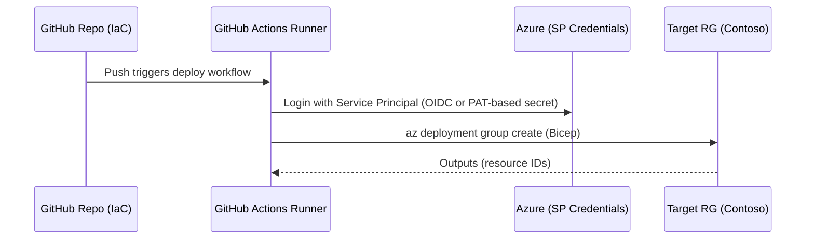

# ⚙️ Day 5 – Migration Automation (Bicep + GitHub Actions)

Azure Tenant Workload Migration Mini-Camp

“If you can script it, you can repeat it.”
Today you’ll build modular Bicep, wire parameters, and set up GitHub Actions to deploy into the Target tenant.

# 🎯 Objectives

By the end of Day 5 you will:

Create modular Bicep for network, VM, storage, and SQL (free-tier shapes).

Parameterize with environment files (East US).

Use GitHub Actions with an Azure Service Principal to deploy into $RG_TARGET.

Dry-run and then deploy a minimal landing workload.

# 🧩 Concept Overview

Analogy:

Think of Bicep modules as LEGO bricks—network, storage, compute, database.
You click them together (main.bicep), choose colors (parameters), and a robot (GitHub Actions) assembles them the same way every time.

We’ll focus on re-deploy (not cross-tenant “move”). Your Day 4 manifest guides what to build in the Target.

# 🧠 Architecture Sequence

---

# 🔧 Hands-On Steps

Prereqs: You’ve got $RG_TARGET and VNets from Day 2. SPs from Day 3.
Ensure source scripts/cli/vars.sh is loaded in your shell.

1) Create Bicep modules

Create the modules directory and files:

nano modules/network.bicep

param location string
param vnetName string
param addressPrefix string
param subnetName string
param subnetPrefix string

resource vnet 'Microsoft.Network/virtualNetworks@2023-11-01' = {
  name: vnetName
  location: location
  properties: {
    addressSpace: { addressPrefixes: [ addressPrefix ] }
    subnets: [
      {
        name: subnetName
        properties: { addressPrefix: subnetPrefix }
      }
    ]
  }
}

output vnetId string = vnet.id

nano modules/storage.bicep

param location string
@minLength(3) @maxLength(24)
param storageName string
param tags object = {}

resource sa 'Microsoft.Storage/storageAccounts@2023-04-01' = {
  name: storageName
  location: location
  sku: { name: 'Standard_LRS' }
  kind: 'StorageV2'
  tags: tags
  properties: {
    accessTier: 'Hot'
    minimumTlsVersion: 'TLS1_2'
    supportsHttpsTrafficOnly: true
  }
}

output storageId string = sa.id

nano modules/sql.bicep

param location string
param sqlServerName string
@secure()
param adminPassword string
param adminUser string = 'sqladmin-learner'
param tags object = {}

resource server 'Microsoft.Sql/servers@2022-05-01-preview' = {
  name: sqlServerName
  location: location
  tags: tags
  properties: {
    administratorLogin: adminUser
    administratorLoginPassword: adminPassword
    publicNetworkAccess: 'Enabled'
    minimalTlsVersion: '1.2'
  }
}

resource db 'Microsoft.Sql/servers/databases@2022-05-01-preview' = {
  name: '${sqlServerName}/sqldb01'
  location: location
  properties: {
    sku: {
      name: 'Basic'
      tier: 'Basic'
    }
  }
}

output sqlServerId string = server.id
output databaseId string = db.id

nano modules/vm.bicep

param location string
param vmName string
param subnetId string
param adminUsername string = 'azureuser'
@secure()
param adminPassword string
param tags object = {}

resource nic 'Microsoft.Network/networkInterfaces@2023-11-01' = {
  name: '${vmName}-nic'
  location: location
  properties: {
    ipConfigurations: [
      {
        name: 'ipconfig1'
        properties: {
          subnet: { id: subnetId }
          privateIPAllocationMethod: 'Dynamic'
        }
      }
    ]
  }
}

resource vm 'Microsoft.Compute/virtualMachines@2023-09-01' = {
  name: vmName
  location: location
  tags: tags
  properties: {
    hardwareProfile: { vmSize: 'Standard_B1s' }
    networkProfile: { networkInterfaces: [ { id: nic.id } ] }
    storageProfile: {
      imageReference: {
        publisher: 'Canonical'
        offer: '0001-com-ubuntu-server-jammy'
        sku: '22_04-lts'
        version: 'latest'
      }
      osDisk: {
        createOption: 'FromImage'
        managedDisk: { storageAccountType: 'Standard_LRS' }
      }
    }
    osProfile: {
      computerName: vmName
      adminUsername: adminUsername
      adminPassword: adminPassword
      linuxConfiguration: { disablePasswordAuthentication: false }
    }
  }
}

output vmId string = vm.id

2) Compose main.bicep
nano scripts/bicep/main.bicep

param location string = 'eastus'
param tags object = {
  Owner: 'olumidetowoju'
  Scenario: 'acquisition'
  Lab: 'day05'
}

@allowed([
  '10.1.0.0/16'
])
param vnetAddress string = '10.1.0.0/16'

param subnetAddress string = '10.1.1.0/24'
param vnetName string = 'vnet-tgt-app'
param subnetName string = 'snet-tgt-app'

param storageName string
param sqlServerName string
@secure()
param sqlAdminPassword string
@secure()
param vmAdminPassword string
param vmName string = 'vm-app-01'

module net './modules/network.bicep' = {
  name: 'network'
  params: {
    location: location
    vnetName: vnetName
    addressPrefix: vnetAddress
    subnetName: subnetName
    subnetPrefix: subnetAddress
  }
}

module sa './modules/storage.bicep' = {
  name: 'storage'
  params: {
    location: location
    storageName: storageName
    tags: tags
  }
}

module sql './modules/sql.bicep' = {
  name: 'sql'
  params: {
    location: location
    sqlServerName: sqlServerName
    adminPassword: sqlAdminPassword
    tags: tags
  }
}

module vm './modules/vm.bicep' = {
  name: 'vm'
  params: {
    location: location
    vmName: vmName
    subnetId: '${net.outputs.vnetId}/subnets/${subnetName}'
    adminPassword: vmAdminPassword
    tags: tags
  }
}

3) Add parameters file (don’t store secrets in Git)
nano params/dev.eastus.json

{
  "$schema": "https://schema.management.azure.com/schemas/2019-04-01/deploymentParameters.json#",
  "contentVersion": "1.0.0.0",
  "parameters": {
    "location": { "value": "eastus" },
    "vnetAddress": { "value": "10.1.0.0/16" },
    "subnetAddress": { "value": "10.1.1.0/24" },
    "vnetName": { "value": "vnet-tgt-app" },
    "subnetName": { "value": "snet-tgt-app" },
    "storageName": { "value": "st01apptgt" },
    "sqlServerName": { "value": "sqltgt01" },
    "vmName": { "value": "vm-app-01" }
  }
}

Secrets (sqlAdminPassword, vmAdminPassword) will be supplied at deploy time (CLI or GitHub Actions secrets), not committed.

4) Local dry-run (Preview)
source scripts/cli/vars.sh

# What-if (preview)
az deployment group what-if \
  --resource-group "$RG_TARGET" \
  --template-file scripts/bicep/main.bicep \
  --parameters @params/dev.eastus.json \
  --parameters sqlAdminPassword="$(read -p 'SQL Admin Password: ' -s p; echo $p)" \
               vmAdminPassword="$(read -p 'VM Admin Password: ' -s p; echo $p)"

5) Local deploy
az deployment group create \
  --name Day05Deploy \
  --resource-group "$RG_TARGET" \
  --template-file scripts/bicep/main.bicep \
  --parameters @params/dev.eastus.json \
  --parameters sqlAdminPassword="$SQL_PASSWORD" vmAdminPassword="$VM_PASSWORD"

You can export SQL_PASSWORD and VM_PASSWORD in your shell, or pass inline like the what-if example.

# 🤖 GitHub Actions CI/CD

A) Prepare credentials (secure)

Use the SP you created (Day 3) or create a new one with --sdk-auth JSON for Actions:

az ad sp create-for-rbac \
  --name contoso-actions-sp \
  --role contributor \
  --scopes "/subscriptions/""/resourceGroups/$RG_TARGET" \
  --sdk-auth

Copy the entire JSON output and save it as a GitHub Repository Secret named: AZURE_CREDENTIALS.
Also add secrets: SQL_ADMIN_PASSWORD, VM_ADMIN_PASSWORD.

B) Workflow file
mkdir -p .github/workflows
nano .github/workflows/deploy.yml

name: Deploy Day05 to Target RG

on:
  workflow_dispatch:
  push:
    paths:
      - "modules/**"
      - "scripts/bicep/**"
      - "params/**"
      - ".github/workflows/deploy.yml"

jobs:
  deploy:
    runs-on: ubuntu-latest
    permissions:
      id-token: write
      contents: read

    steps:
      - name: Checkout
        uses: actions/checkout@v4

      - name: Azure Login
        uses: azure/login@v2
        with:
          creds: ${{ secrets.AZURE_CREDENTIALS }}

      - name: Bicep version
        run: az bicep version

      - name: What-if
        run: |
          az deployment group what-if \
            --resource-group "${{ env.RG_TARGET }}" \
            --template-file scripts/bicep/main.bicep \
            --parameters @params/dev.eastus.json \
            --parameters sqlAdminPassword='${{ secrets.SQL_ADMIN_PASSWORD }}' \
                         vmAdminPassword='${{ secrets.VM_ADMIN_PASSWORD }}'
        env:
          RG_TARGET: ${{ env.RG_TARGET }}

      - name: Deploy
        run: |
          az deployment group create \
            --name "Day05ActionDeploy" \
            --resource-group "${{ env.RG_TARGET }}" \
            --template-file scripts/bicep/main.bicep \
            --parameters @params/dev.eastus.json \
            --parameters sqlAdminPassword='${{ secrets.SQL_ADMIN_PASSWORD }}' \
                         vmAdminPassword='${{ secrets.VM_ADMIN_PASSWORD }}'
        env:
          RG_TARGET: ${{ env.RG_TARGET }}

Set a repo-level environment variable RG_TARGET=rg-01-eus-tgt
(Repo → Settings → Secrets and variables → Variables → RG_TARGET = your target RG)

# 🧪 Validate

az resource list -g "$RG_TARGET" -o table
az sql server list -g "$RG_TARGET" -o table
az network vnet list -g "$RG_TARGET" -o table
az vm list -g "$RG_TARGET" -d -o table

# 🧩 Quiz – Checkpoint

Why do we split modules (network/storage/compute/sql) instead of a single file?

What’s the purpose of a parameters file?

Where should secrets be stored for GitHub Actions?

Which command previews changes without deploying?

How would you map names from your migration-manifest.csv into Bicep parameters?

# 🧼 Cleanup (Optional)

az deployment group delete -g "$RG_TARGET" -n Day05Deploy
# To fully remove resources, delete the RG (careful!):
# az group delete -n "$RG_TARGET" --yes --no-wait

# ✅ Checkpoint

 VM deployed successfully

 SQL Server + Database created

 Storage Account provisioned

 GitHub Action logs validated

 Outputs exported to /docs/

# 📅 Next Step

➡ Proceed to Day 6 – Data & Apps Migration

We’ll migrate data (Blob/SQL) and app content, validate connections, and prep for cutover.

Authored by Olumide Towoju

Course Version 1.0 | Region: East US | License: Free Tier Learning Use
