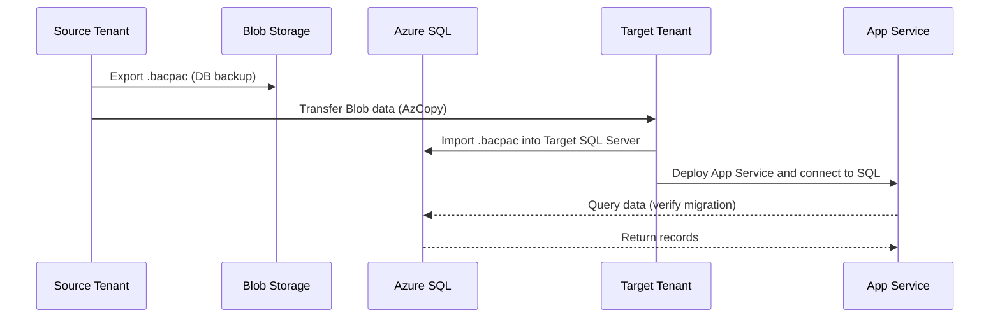

# **Day 6 – Data & Apps Migration (Azure SQL | Blob | Web App)**

In Day 5, you automated infrastructure creation using Bicep + GitHub Actions.  
Today, we shift focus from *deploying* workloads to *moving* the actual **data and applications** across tenants.

Think of Day 5 as building the “new house,” and Day 6 as **packing and moving your furniture** into it.

---

## 🎯 Learning Objectives
By the end of this lab, you will be able to:

- Migrate Azure SQL databases across tenants using **bacpac exports/imports**  
- Sync and move Blob Storage contents securely between tenants  
- Deploy an **App Service** connected to the migrated database  
- Validate connections and permissions across tenants  

---
⚙️ Section 1 – Database Migration (Azure SQL → Azure SQL)

We’ll use bacpac files and the az sql db commands

# Export database from source tenant
az sql db export \
  --admin-user "sqladmin-learner" \
  --admin-password "$SQL_PASSWORD" \
  --name "sqldb01" \
  --server "$SRC_SQL_SERVER" \
  --storage-key-type "StorageAccessKey" \
  --storage-key "$SRC_STORAGE_KEY" \
  --storage-uri "https://$SRC_STORAGE_ACCOUNT.blob.core.windows.net/exports/sqldb01.bacpac"

# Import database into target tenant
az sql db import \
  --admin-user "sqladmin-learner" \
  --admin-password "$SQL_PASSWORD" \
  --name "sqldb01" \
  --server "$TGT_SQL_SERVER" \
  --storage-key-type "StorageAccessKey" \
  --storage-key "$TGT_STORAGE_KEY" \
  --storage-uri "https://$TGT_STORAGE_ACCOUNT.blob.core.windows.net/exports/sqldb01.bacpac"

⚙️ Section 2 – Blob Storage Migration
Use AzCopy for bulk data copy.

# Install if not already
sudo apt install -y azcopy

# Login to each tenant interactively
azcopy login --tenant-id $SRC_TENANT_ID
azcopy login --tenant-id $TGT_TENANT_ID

# Copy all containers from source to target
azcopy copy "https://$SRC_STORAGE_ACCOUNT.blob.core.windows.net/*?$SRC_SAS" \
            "https://$TGT_STORAGE_ACCOUNT.blob.core.windows.net/?$TGT_SAS" \
            --recursive

⚙️ Section 3 – Web App Deployment and Configuration
We’ll deploy a lightweight App Service web app connected to the migrated SQL DB.

az webapp up \
  --name "$WEBAPP_NAME" \
  --resource-group "$RG_TARGET" \
  --runtime "DOTNET:8" \
  --location "$LOCATION"

# Configure connection string
az webapp config connection-string set \
  --name "$WEBAPP_NAME" \
  --resource-group "$RG_TARGET" \
  --settings "DefaultConnection=Server=tcp:$TGT_SQL_SERVER.database.windows.net,1433;Initial Catalog=sqldb01;User ID=sqladmin-learner;Password=$SQL_PASSWORD;Encrypt=True;" \
  --connection-string-type SQLAzure

🧩 Sequence Diagram

---

✅ Checkpoint
Goal	Verification Command
SQL Database imported	az sql db list -g "$RG_TARGET" -o table
Blob data migrated	az storage blob list --account-name $TGT_STORAGE_ACCOUNT -o table
App Service deployed	az webapp list -g "$RG_TARGET" -o table
Web app connected	Test URL response → HTTP 200 OK

🧠 Analogy
Imagine you’ve just built a brand-new office in another city (Day 5).
Day 6 is the moving day — shipping all files, desks, and computers (your data & apps) safely to the new site while keeping everything intact.

📝 Assessment Checkpoint (Review Questions)
What tool can migrate Blob Storage data across tenants?

Why are .bacpac files preferred for Azure SQL cross-tenant migration?

How would you validate that your App Service is connected to the correct SQL database?

How does AzCopy authenticate between two different tenants?

Next → Day 7 – Security & Data Protection
