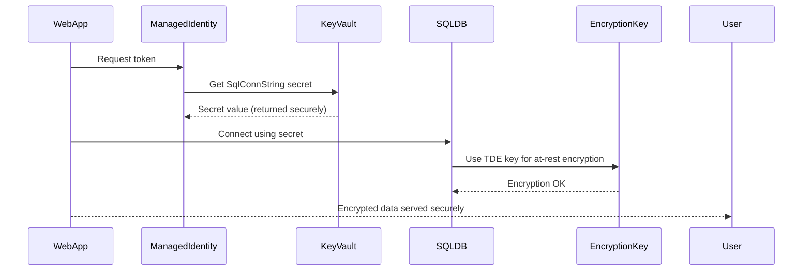

# **Day 7 – Security & Data Protection (Key Vault, Encryption & Access Policies)**

Welcome to the security hardening phase.  
If Day 6 was about *moving the valuables into the new building*, Day 7 is about **locking the vault and setting up guards**.

---

## 🎯 Learning Objectives
By the end of this lab, you will:

- Protect secrets and credentials in **Azure Key Vault**  
- Enable **Transparent Data Encryption (TDE)** for SQL Databases  
- Use **Managed Identities** to access secrets without storing passwords  
- Implement **Access Policies** and **Private Link** for Key Vault  
- Understand **customer-managed keys (CMK)** vs. service-managed keys (SMK)

---

⚙️ Section 1 – Create Key Vault and Secure Secrets

source scripts/cli/vars.sh
export KV_NAME="kv-tgt-olumi"

az keyvault create \
  --name "$KV_NAME" \
  --resource-group "$RG_TARGET" \
  --location "$LOCATION"

# Add a sample secret (SQL connection string)
az keyvault secret set \
  --vault-name "$KV_NAME" \
  --name "SqlConnString" \
  --value "Server=tcp:$TGT_SQL_SERVER.database.windows.net,1433;Database=sqldb01;User ID=sqladmin-learner;Password=$SQL_PASSWORD;Encrypt=True;"

⚙️ Section 2 – Enable Transparent Data Encryption (TDE)
Azure SQL automatically uses a Microsoft-managed key, but you can bring your own CMK from Key Vault.

# Create a Key Vault Key
az keyvault key create \
  --vault-name "$KV_NAME" \
  --name "sql-tde-key" \
  --protection software

# Associate with SQL Server
az sql server tde-key set \
  --server "$TGT_SQL_SERVER" \
  --resource-group "$RG_TARGET" \
  --kid "$(az keyvault key show --vault-name "$KV_NAME" --name sql-tde-key --query id -o tsv)"

# Verify TDE status
az sql db tde show -g "$RG_TARGET" -s "$TGT_SQL_SERVER" -d sqldb01 -o table

⚙️ Section 3 – Enable Managed Identity and Grant Access

# Enable system-assigned identity on the App Service
az webapp identity assign \
  --name "$WEBAPP_NAME" \
  --resource-group "$RG_TARGET"

# Get the principal ID
APP_ID=$(az webapp show -n "$WEBAPP_NAME" -g "$RG_TARGET" --query identity.principalId -o tsv)

# Grant Key Vault access to that identity
az keyvault set-policy \
  --name "$KV_NAME" \
  --object-id "$APP_ID" \
  --secret-permissions get list
Your web app can now fetch secrets directly from Key Vault without embedding credentials.

⚙️ Section 4 – Private Link for Key Vault (Optional)

az network private-endpoint create \
  --name kv-plink-endpoint \
  --resource-group "$RG_TARGET" \
  --vnet-name vnet-tgt-app \
  --subnet snet-tgt-app \
  --private-connection-resource-id $(az keyvault show -n "$KV_NAME" -g "$RG_TARGET" --query id -o tsv) \
  --group-id vault \
  --connection-name kv-plink-conn
This restricts access to internal VNet traffic only.

🧩 Sequence Diagram

---

🧠 Analogy
Think of Key Vault as the bank vault and Managed Identity as the authorized keycard.
TDE acts like automatic encryption on every hard drive in the bank — even if someone steals a drive, they can’t read it without the vault key.

✅ Checkpoint
Task	Verification
Key Vault exists	az keyvault list -g "$RG_TARGET" -o table
Secret stored	az keyvault secret list --vault-name "$KV_NAME" -o table
Managed Identity assigned	az webapp identity show -n "$WEBAPP_NAME" -g "$RG_TARGET" -o table
TDE enabled	az sql db tde show -g "$RG_TARGET" -s "$TGT_SQL_SERVER" -d sqldb01 -o table

📝 Assessment Questions
What advantage does Managed Identity have over storing secrets in app settings?

What is the difference between service-managed and customer-managed keys for TDE?

How does Private Link enhance Key Vault security?

Which Azure CLI command grants a web app access to Key Vault secrets?

Next → Day 8 – Monitoring & Compliance Policies
