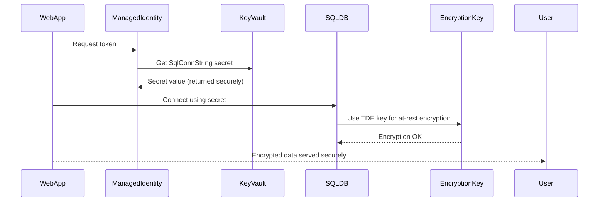

# 🧩 Day 7 – Validate & Secure the Migration

Welcome to **Day 7** of the **Azure Tenant Workload Migration Bootcamp**.

This day focuses on validating data integrity, enabling encryption, storing connection strings securely in Azure Key Vault, and implementing post-migration security hardening.

---

## 🎯 Objectives

- Validate that migrated SQL DB and VM workloads function correctly  
- Use `sqlcmd` and firewall configuration to test connectivity  
- Secure connection strings with Azure Key Vault  
- Compare RBAC vs Access Policy models  
- Implement Azure Defender and auditing features  

---

## 🧠 Conceptual Analogy

Think of your migration like moving valuables into a new vault 🏦.  
Before you trust it:
- You test the keys (firewall + connectivity) 🔑  
- You verify locks (encryption + policies) 🔒  
- And you confirm who can open it (RBAC + Access Policies) 👥  

---

🧩 Sequence Diagram

---

## 🧪 Lab Steps

### 1️⃣ Connectivity Verification (sqlcmd + Firewall Troubleshooting)

# Allow client IP
az sql server firewall-rule create \
  -g "$RG_TARGET" \
  -s "$TGT_SQL_SERVER" \
  -n AllowMyClientIP \
  --start-ip-address $(curl -s https://ifconfig.me) \
  --end-ip-address $(curl -s https://ifconfig.me)

# Test connectivity
sqlcmd -S "$TGT_SQL_SERVER.database.windows.net" \
       -d sqldb01 \
       -U "sqladmin-learner" \
       -P "$SQL_PASSWORD" \
       -Q "SELECT DB_NAME(); SELECT TOP 5 name FROM sys.tables;"
If you see an error such as
Client with IP address is not allowed to access the server,
return to Azure Portal → SQL Server → Networking → check
✅ Allow Azure services and resources to access this server.

2️⃣ Store SQL Connection String in Azure Key Vault

az keyvault secret set \
  --vault-name kv-tgt-olumi \
  --name "SqlConnString" \
  --value "Server=tcp:$TGT_SQL_SERVER.database.windows.net,1433;Database=sqldb01;User ID=sqladmin-learner;Password=$SQL_PASSWORD;Encrypt=True;"
If you encounter a Forbidden (RBAC) error, use the appendix below.

🔒 RBAC vs Access Policy Troubleshooting Appendix
Identify your user and access mode

az account show -o table
az ad signed-in-user show --query "{displayName:displayName,objectId:id}"
az keyvault show -n kv-tgt-olumi --query "{name:name,enableRbacAuthorization:properties.enableRbacAuthorization}" -o jsonc

Option A – Grant “Key Vault Administrator”

MYID=$(az ad signed-in-user show --query id -o tsv)
az role assignment create \
  --assignee "$MYID" \
  --role "Key Vault Administrator" \
  --scope $(az keyvault show -n kv-tgt-olumi --query id -o tsv)
Wait 2–5 minutes → retry az keyvault secret set.

Option B – Switch to Legacy Access Policy

az keyvault update -n kv-tgt-olumi --enable-rbac-authorization false
MYID=$(az ad signed-in-user show --query id -o tsv)
az keyvault set-policy -n kv-tgt-olumi --object-id "$MYID" \
  --secret-permissions get list set delete

Verify Secret

az keyvault secret list --vault-name kv-tgt-olumi -o table
az keyvault secret show --vault-name kv-tgt-olumi --name SqlConnString -o jsonc

🧩 Summary
Task	Verification Tool
Firewall & Connectivity	sqlcmd, Portal Networking
Key Vault Access	RBAC or Access Policy
Secret Storage	az keyvault secret set / show
Audit Log Review	Azure Monitor / Defender

🧠 Checkpoint Quiz
1️⃣ What CLI flag determines whether a Key Vault uses RBAC authorization?
2️⃣ What command adds your IP address to SQL Server firewall rules?
3️⃣ Why might the same password work in sqlcmd but not in the Portal?

🧭 Next Step
➡ Day 8 – Monitoring & Compliance Policies
