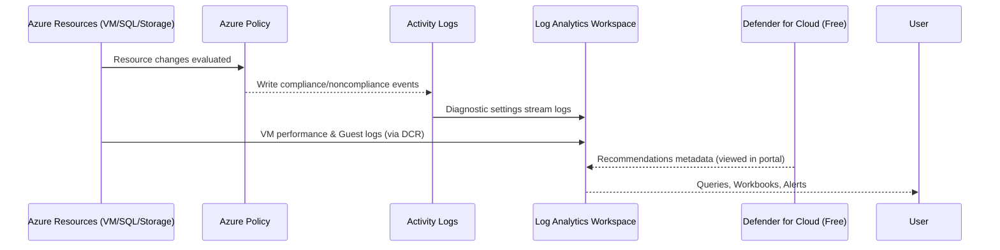

# **Day 8 – Monitoring & Compliance Policies (Azure Monitor | Log Analytics | Azure Policy | Defender for Cloud Free)**

Yesterday we locked the vault (Day 7). Today we install **cameras and auditors**: telemetry, alerts, policy compliance, and secure baselines.

Think of this like a **facility security team**:
- **Azure Monitor & Log Analytics** = CCTV + event logs
- **Azure Policy** = the rules every room must follow
- **Defender for Cloud (Free)** = the security inspector giving recommendations

---

## 🎯 Learning Objectives
- Create a **Log Analytics Workspace (LAW)** and connect resources
- Stream **Activity Logs** and **VM Insights** to LAW
- Enforce **Azure Policies** for security/compliance baselines
- Enable **Defender for Cloud (Free tier)** recommendations (no paid plans)
- Validate compliance and create an alert rule

---

Note: We’ll stay free-tier friendly:

Use Defender for Cloud Free (recommendations only)

Use Log Analytics sparingly (VM Insights can incur cost; enable for 1 small VM)

⚙️ Section 1 — Create/Connect a Log Analytics Workspace

# Prereqs (from repo vars)
source scripts/cli/vars.sh

# 1) Create LAW
export LAW_NAME="law-migrate-eus2"
az monitor log-analytics workspace create \
  -g "$RG_TARGET" \
  -n "$LAW_NAME" \
  -l "$LOCATION"

# 2) Link the VM to LAW via Data Collection Rule (DCR)
# (uses the 'vm-app-01' we built on Day 5 — adjust if needed)
export VM_NAME="${VM_NAME:-vm-app-01}"

# Create a default DCR to collect performance + syslogs
export DCR_NAME="dcr-vmperf-syslog"
az monitor data-collection rule create \
  -g "$RG_TARGET" \
  -n "$DCR_NAME" \
  --location "$LOCATION" \
  --data-flows file://"scripts/json/dcr-vm-perf-syslog.json" 2>/dev/null || true

# If you don't have the JSON file, create a minimal DCR quickly:
cat > /tmp/dcr-min.json <<'JSON'
{
  "location": "eastus2",
  "kind": "Linux",
  "properties": {
    "dataSources": {
      "performanceCounters": [
        {
          "streams": [ "Microsoft-Perf" ],
          "samplingFrequencyInSeconds": 60,
          "counterSpecifiers": [
            "\\Processor(_Total)\\% Processor Time",
            "\\Memory\\Available MBytes",
            "\\LogicalDisk(_Total)\\% Free Space"
          ],
          "name": "perf-default"
        }
      ]
    },
    "destinations": {
      "logAnalytics": [
        {
          "workspaceResourceId": "/subscriptions/__SUB__/resourceGroups/__RG__/providers/Microsoft.OperationalInsights/workspaces/__LAW__",
          "name": "la"
        }
      ]
    },
    "dataFlows": [
      { "streams": [ "Microsoft-Perf" ], "destinations": [ "la" ] }
    ]
  }
}
JSON

# We Replace placeholders and create the DCR
SUB_ID=$(az account show --query id -o tsv)
sed -i "s#__SUB__#${SUB_ID}#g; s#__RG__#${RG_TARGET}#g; s#__LAW__#${LAW_NAME}#g" /tmp/dcr-min.json
az resource create -g "$RG_TARGET" -n "$DCR_NAME" --resource-type "Microsoft.Insights/dataCollectionRules" \
  --is-full-object --properties @"'/tmp/dcr-min.json'"

# 3) Associate DCR to VM
VM_ID=$(az vm show -g "$RG_TARGET" -n "$VM_NAME" --query id -o tsv)
az monitor data-collection rule association create \
  --association-name "vm-dcr" \
  --data-collection-rule "/subscriptions/${SUB_ID}/resourceGroups/${RG_TARGET}/providers/Microsoft.Insights/dataCollectionRules/${DCR_NAME}" \
  --resource "$VM_ID"

Tip: It can take ~5–10 minutes for VM insights data to appear in LAW. Use Logs → run Perf | limit 10.

⚙️ Section 2 — Stream Tenant Activity Logs to LAW (Subscription-level)

# Create a Diagnostic Setting at the subscription scope to LAW
export DIAG_NAME="sub-activity-to-law"
az monitor diagnostic-settings create \
  --name "$DIAG_NAME" \
  --resource "/subscriptions/$SUB_ID" \
  --w
orkspace "$(az monitor log-analytics workspace show -g "$RG_TARGET" -n "$LAW_NAME" --query id -o tsv)" \
  --logs '[{"category":"Administrative","enabled":true},{"category":"Security","enabled":true},{"category":"ServiceHealth","enabled":true},{"category":"Alert","enabled":true},{"category":"Recommendation","enabled":true},{"category":"Policy","enabled":true}]'

Now Activity Logs (e.g., policy changes, RBAC changes) land in LAW.

⚙️ Section 3 — Enforce a Minimal Policy Baseline (Free)

We’ll assign built-in Azure Policies:

Require resources to have a tag: owner

Audit VMs with insecure password auth enabled (Linux)

Audit missing diagnostics to LAW for supported types

# 1) Create/ensure a Tag Policy assignment at the RG scope
export POL_SCOPE="/subscriptions/$SUB_ID/resourceGroups/$RG_TARGET"

# Tag rule: Add if missing (DeployIfNotExists requires a remediation identity)
az policy assignment create \
  --name "require-owner-tag" \
  --display-name "Require Owner Tag on Resources" \
  --policy "/providers/Microsoft.Authorization/policyDefinitions/9a3b98ff-6f17-48b7-8217-165bd065b05e" \
  --scope "$POL_SCOPE" \
  --params '{ "tagName": { "value": "owner" }, "tagValue": { "value": "olumidetowoju" } }' \
  --enforcement-mode Default

# 2) Audit Linux VMs that allow password auth (security hygiene)
az policy assignment create \
  --name "audit-linux-password-auth" \
  --display-name "Audit Linux VMs that allow password authentication" \
  --policy "/providers/Microsoft.Authorization/policyDefinitions/1caf7aa3-5e23-4f2c-9b3b-4f6c3f1d2db1" \
  --scope "$POL_SCOPE"

# 3) Audit missing diagnostic settings to LAW (broad categories)
az policy assignment create \
  --name "audit-missing-diagnostics" \
  --display-name "Audit missing diagnostic settings to LAW" \
  --policy "/providers/Microsoft.Authorization/policyDefinitions/dae2b6b3-4b2d-4f2d-9f77-5bda1ab2d5e6" \
  --scope "$POL_SCOPE" \
  --params "{ \"logAnalytics\": { \"value\": \"$(az monitor log-analytics workspace show -g "$RG_TARGET" -n "$LAW_NAME" --query customerId -o tsv)\" } }" || true

If any policy definition IDs differ in your tenant, use Portal → Policy → Definitions to pick equivalent built-in policies. For the lab, Audit-level assignments are enough and cost-free.

⚙️ Section 4 — Defender for Cloud (Free Tier Only)

# Ensure the free tier (no charges for recommendations)
az security pricing create --name VirtualMachines --tier Free
az security pricing create --name SqlServers --tier Free
az security pricing create --name StorageAccounts --tier Free

# List your current plan tiers
az security pricing list -o table

Open Portal → Defender for Cloud → you’ll get security recommendations without turning on paid plans.

⚙️ Section 5 — Create a Simple Alert Rule (Activity Log → LAW Query)

We’ll create a basic alert that fires on Policy NonCompliance events.

# KQL query (Activity Log in LAW)
cat > /tmp/policy_noncompliance.kql <<'KQL'
AzureActivity
| where CategoryValue == "Policy"
| where OperationNameValue =~ "Microsoft.Authorization/policyAssignments/audit/action"
| project TimeGenerated, ResourceGroup, OperationNameValue, ActivityStatusValue, CorrelationId
| limit 50
KQL

# Create an alert rule from LAW (Portal recommended for full wizard)
echo "Use Portal → Monitor → Alerts → + Create → Log alert rule"
echo "Paste the KQL above; set LAW = $LAW_NAME, RG = $RG_TARGET"

🧩 Sequence Diagram

---

✅ Checkpoint
Goal	How to Verify
LAW exists	az monitor log-analytics workspace list -g "$RG_TARGET" -o table
VM sending perf logs	LAW → Logs → run `Perf
Activity Logs flowing	LAW → Logs → run KQL from Section 5
Policies assigned	az policy assignment list --scope "$POL_SCOPE" -o table
Defender Free plans	az security pricing list -o table

🧠 Assessment (short quiz)

What is the free way to get security recommendations without enabling paid plans?

Why is a Data Collection Rule needed for VM logs?

Which scope is best to assign policies for this lab: subscription or resource group? Why?

Next → Day 9 – Cutover & Post-Migration Validation
