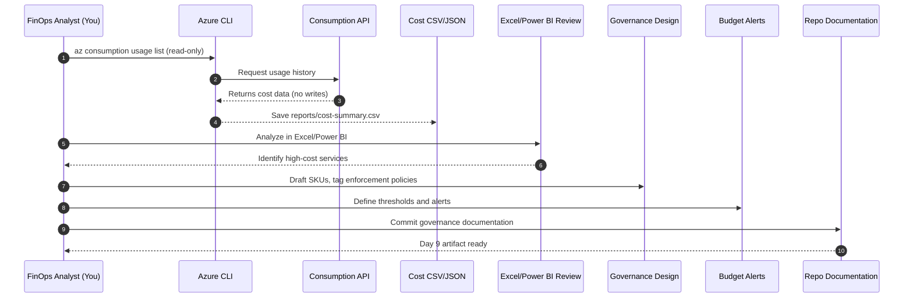

# 💰 Day 9 – Cost Governance & Post-Migration Review

> **Objective:** Learn how to analyze, visualize, and govern costs after migration — **without re-enabling billing**.

---

## 🎯 Learning Goals
- Understand Azure cost governance principles (tags, budgets, policy).
- Review existing spend data safely in **read-only mode**.
- Export cost and usage data to CSV for reporting.
- Design a cost-control strategy for future tenant migrations.

---

## 🧩 1. Exporting Cost Data (Read-Only Safe)
Even though your subscription is disabled, you can still pull **historical usage data**.

**Export cost and usage for the last 30 days**

az consumption usage list \
  --start-date 2025-10-01 \
  --end-date 2025-11-01 \
  -o table

**Save to CSV for offline analysis**

az consumption usage list \
  --start-date 2025-10-01 \
  --end-date 2025-11-01 \
  -o tsv > reports/cost-summary.csv
This doesn’t create or delete resources — ✅ safe under Free Tier read-only mode.

## 🧠 2. Governance Pillars Recap

Pillar	Description	Example
Tagging	Identify resource ownership and cost centers.	env=prod, owner=olumide
Budgets	Alert when costs exceed thresholds.	Free-tier $200 cap
Policies	Enforce resource standards.	Restrict VM SKUs to low-cost tiers
Monitoring	Visualize cost trends.	Azure Cost Management + Power BI
Automation	Auto-shutdown dev/test resources.	Logic App or CLI automation

## 📊 3. 

---

## ⚙️ 4. Script Example

scripts/export-costs.sh

#!/bin/bash

**Export cost usage without modifying resources**

az consumption usage list \
  --start-date "$(date -I -d '30 days ago')" \
  --end-date "$(date -I)" \
  -o json > ../reports/cost-summary.json
echo "✅ Cost summary exported safely."

## 🧩 5. Assessment Checkpoint

Q1. What’s the difference between cost visibility and cost control?
Q2. Why are “tags” critical for chargeback accounting?
Q3. How can Azure Policy prevent cost overruns?
Q4. What steps would you automate in future tenant migrations?

## 🪙 6. Instructor Notes

This module intentionally stays within free-tier operations.

In a real tenant-to-tenant migration, these scripts feed into Azure Cost Management Exports or FinOps dashboards.

Optional integration: push CSV into a GitHub Actions artifact for continuous reporting.

## 🧾 7. Summary

Topic	Key Takeaway
Governance	Prevents future overspend
Read-only mode	Still allows safe reporting
Documentation	Essential for audit/compliance
FinOps	Continuous improvement discipline

➡️ Next Step: Day 10 – Final Review & Decommissioning
