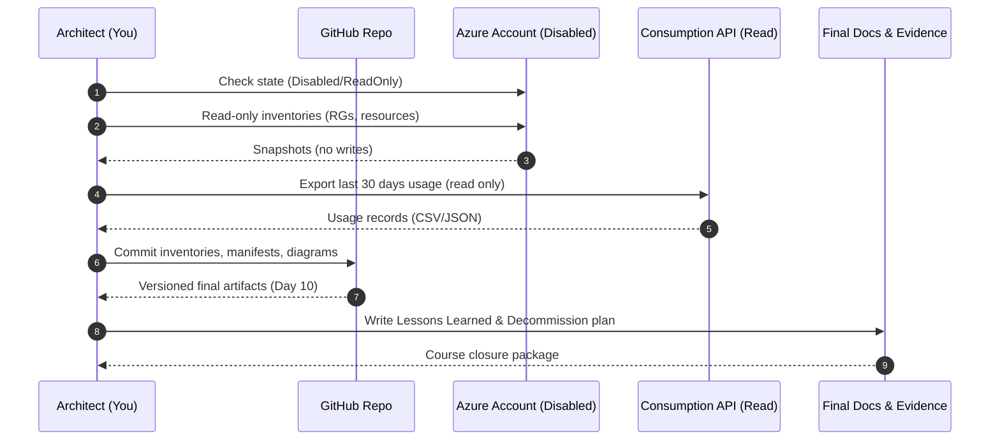

# 🏁 Day 10 – Final Review & Decommissioning (Archive • Evidence • Next Steps)

> Goal: close out the migration mini-camp with a **clean paper trail**, **archived artifacts**, and a **zero-billing posture**.  
> Your subscription remains **Disabled/ReadOnly**—we do documentation-only steps.

---

## 🎯 Outcomes
- Compile evidence of what was migrated and validated
- Archive runbooks, manifests, and diagrams in this repo
- Generate a final “as-built” summary (read-only data)
- Document a decommissioning checklist for future real-world runs

---

## 🧭 What you’ll archive today
- **Inventories**: `docs/inventory/*.json` (Day 8/9 exports)
- **Manifests**: `docs/migration-manifest.csv`
- **Templates & scripts**: `scripts/` and `modules/`
- **Diagrams**: `day0*/**/*.mmd` and `.md` Mermaid diagrams
- **Governance notes**: Day 7–9 RBAC, Key Vault, cost governance

---

## 🔐 Read-only validations (safe in Disabled state)

# Subscription state snapshot
az account show --query "{name:name,id:id,state:state}" -o table

# Resource groups & resources snapshot (read-only)
az group list -o table
az resource list --query "[].{Name:name,Type:type,RG:resourceGroup}" -o table

# Cost history (read-only)
az consumption usage list --start-date "$(date -I -d '30 days ago')" --end-date "$(date -I)" -o table
Save any outputs into docs/final/ as evidence.

🧩 Sequence Diagram — Day 10 Closeout

---

📦 Archiving steps

mkdir -p docs/final

# Save point-in-time evidence (read-only)
az account show -o json > docs/final/subscription.json
az group list -o json > docs/final/resource-groups.json
az resource list -o json > docs/final/resources.json
az consumption usage list \
  --start-date "$(date -I -d '30 days ago')" \
  --end-date "$(date -I)" \
  -o json > docs/final/cost-last-30d.json

Add a short manifest:

cat > docs/final/README.md <<'EOF'

# Final Evidence Bundle
- `subscription.json`: subscription state snapshot
- `resource-groups.json`, `resources.json`: inventories at closure
- `cost-last-30d.json`: historical usage (read-only export)
- Links: Day 7 (Security), Day 8 (Monitoring notes), Day 9 (Cost)
EOF

✅ Decommissioning Checklist (for real cutovers later)
Communication: stakeholder sign-off; freeze window agreed.

Identity & Access: remove cross-tenant trust; rotate secrets/keys.

Data: verify final backups; confirm retention policy; revoke exports.

Network: remove peering/Private Endpoints; close firewalls; remove IP allow rules.

Monitoring: disable diagnostics exports; archive logs/workbooks.

Policies: remove temporary policy assignments/remediation identities.

Delete or Archive: deallocate & delete resources, then purge vaults (avoid soft-delete drift).

Cost: validate $0 run-rate; close budgets/alerts; export final invoice.

Docs: update runbook, lessons learned, and PR to main.

For this free-tier edition, we stop at documentation; your subscription is already Disabled/ReadOnly.

🧠 Lessons Learned (template)
Constraints hit: VM SKU unavailability (East US), SQL server region restrictions, RBAC vs Access Policy for Key Vault, subscription read-only flips.

What worked well: modular Bicep, parameter split for region conflicts, firewall troubleshooting playbook.

Changes for production: Private Link for SQL/Key Vault, CMK for TDE with HSM, CI/CD approvals, policy at subscription/management group with exemptions.

Add your notes here ➜ docs/final/lessons-learned.md.

🏷️ Certificate of Completion (optional)
text
Copy code
Azure Tenant Workload Migration – Blockbuster Mini-Camp
Participant: Olumide (olumidetowoju)
Completed: Day 1–10 (Free-Tier Edition, Documentation Closeout)
Repository: github.com/olumidetowoju/azure-tenant-workload-migration

🔗 Navigation
← Day 9 – Cleanup & Cost Governance

→ Back to Root README
